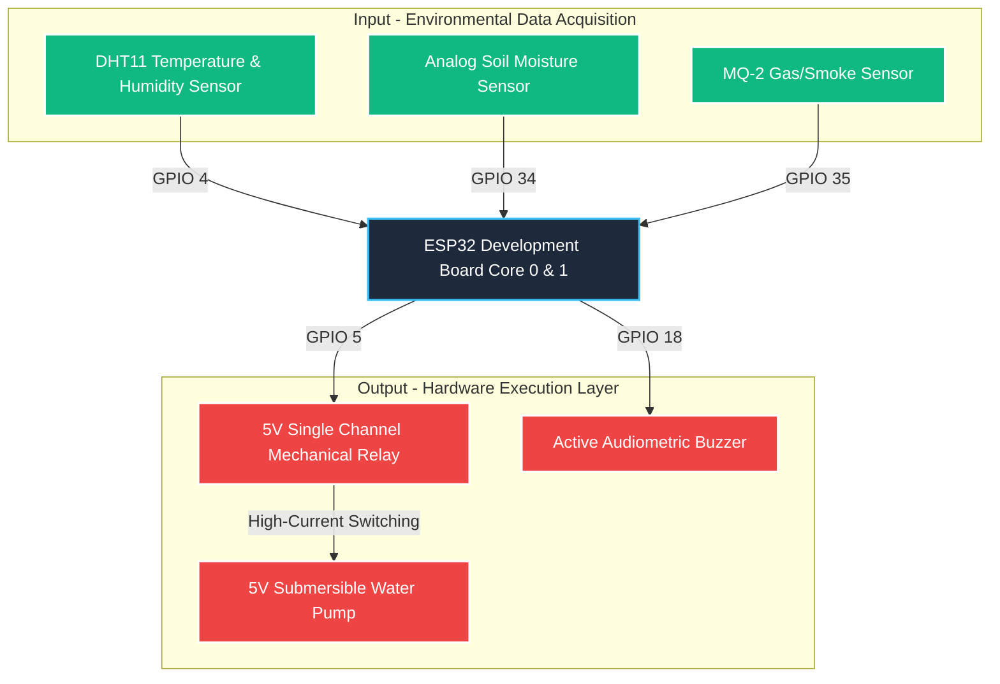

# SmartGreen: Real-Time Autonomous Greenhouse Node

A FreeRTOS-driven, edge-computing embedded system designed for autonomous microclimate management and localized hazard detection using the ESP32 architecture.

This project transitions standard sequential greenhouse monitoring into a deterministic, real-time operating system (RTOS) framework. By exploiting the dual-core design of the ESP32, it guarantees zero-latency execution of critical safety interrupts alongside non-blocking environmental control loops.

---

## Key Features

* **Deterministic Multitasking (FreeRTOS):** Decouples processing into isolated, prioritized tasks to completely eliminate computational blocking caused by sensor polling delays.
* **Automated Soft Irrigation:** Implements an analog soil impedance analysis algorithm coupled with a programmatic hysteresis loop to mitigate rapid relay cycling and prevent localized soil flooding.
* **Life-Safety Hazard Interruption:** Continuous high-frequency atmospheric sampling via an electrochemical sensor array to trigger localized audiometric alarms upon detecting hazardous gas anomalies.
* **Comprehensive Telemetry:** Real-time data serialization over the hardware UART interface for active debugging and performance auditing.

---

## System Architecture & Hardware Logic

The system splits computational workloads across the ESP32's processing units to maximize throughput and achieve reliable fault isolation:



---

## Hardware Configuration & Pinout

To prevent signaling degradation, ensure a unified common ground (GND) plane is maintained across both the 3.3V logic and 5V power domains.

| Component | Sub-System Function | ESP32 Pin Assignment | Operating Voltage |
| :--- | :--- | :--- | :--- |
| **DHT11 Sensor** | Ambient Temperature & Humidity | `GPIO 4` (Digital) | 3.3V |
| **Soil Moisture Sensor** | Soil Impedance Evaluation | `GPIO 34` (Analog/ADC6) | 3.3V |
| **MQ-2 Sensor** | Combustible Gas Detection | `GPIO 35` (Analog/ADC7) | 5V |
| **Single-Channel Relay**| High-Current Pump Isolation | `GPIO 5` (Digital) | 5V |
| **Active Buzzer** | Localized Acoustic Notification | `GPIO 18` (Digital) | 3.3V (Logic) |

---

## Firmware Architecture (FreeRTOS Task Model)

The application firmware bypasses the restrictive sequential structure of the default Arduino runtime, implementing pre-emptive task scheduling instead:

### Core 1 Execution Domain
* **`SensorTask` (Priority 1):** Instantiated to poll the DHT11, MQ-2, and soil moisture sensors every 2000ms. It writes raw data directly to memory registers.
* **`IrrigationTask` (Priority 1):** Runs every 1000ms to evaluate soil dryness data. It manages the mechanical relay state machine based on the operational hysteresis window.

### Core 0 Execution Domain
* **`AlarmTask` (Priority 2):** A high-priority, low-latency execution block that samples environmental air quality data at a 10Hz frequency (every 100ms). It retains the capacity to preempt other tasks to ensure instant buzzer actuation during localized emergencies.

---

## Installation & Deployment

### 1. Toolchain Setup
1. Open the project inside the **Arduino IDE**.
2. Navigate to the Library Manager and install the verified external hardware abstraction library:
   * `DHT sensor library` by Adafruit
3. Choose the appropriate **ESP32 Dev Module** board profile within the target hardware configuration menu.
4. Set the native serial communication speed to `115200` baud.

### 2. Flashing the Node
Connect the ESP32 development board to your workstation via a USB data interface and click **Upload**. If the compiler halts during the synchronization phase, press and hold the physical **BOOT** switch on the board to force flashing mode.

---

## Calibration & Empirical Thresholds

Firmware operational parameters are governed by localized macro-definitions to simplify environment tuning:

| Constant | Hardcoded Value | Operational Condition |
| :--- | :--- | :--- |
| `KURU_ESIK` | `2800` | Upper bound trigger. Activates the 5V submersible pump if soil moisture drops past this point. |
| `ISLAK_ESIK` | `2000` | Lower bound trigger. Suspends irrigation once adequate volumetric water content is verified. |
| `GAZ_ESIK` | `2000` | Safety limit. Immediately engages the audiometric alert sequence if gas particle levels cross this threshold. |

*Note: The deliberate 1000-point buffer zone tracking between `KURU_ESIK` and `ISLAK_ESIK` functions as a software-defined hysteresis controller to suppress rapid structural switching of the mechanical relay contacts.*

---

## Repository Structure

```text
Smart-Greenhouse-ESP32/
├── src/
│   └── Smart_Greenhouse.ino      # Multi-tasking application source code
├── docs/
│   └── Project_Report.pdf        # System documentation and cost analysis
└── README.md                     # Technical documentation showcase
```